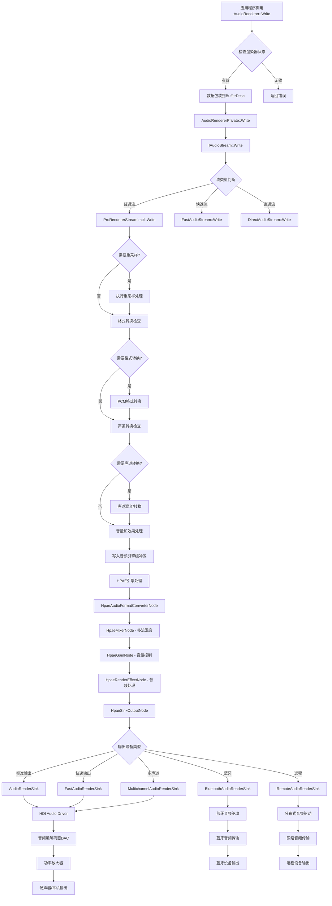
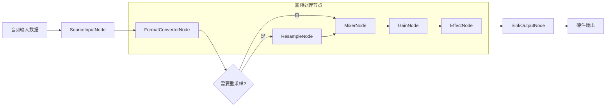
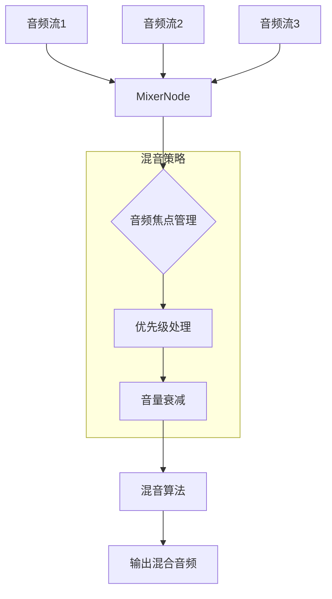
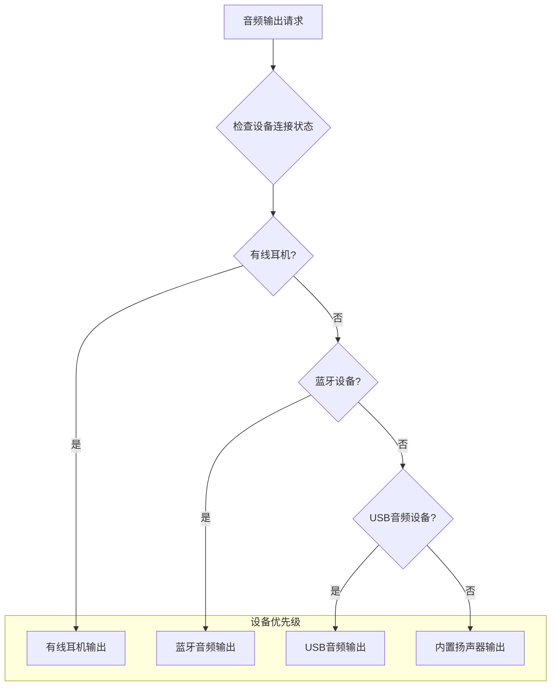
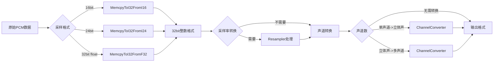

# 音频数据流程图

## 1. 完整音频数据流程图

```mermaid
graph TD
    A[应用程序调用AudioRenderer::Write] --> B{检查渲染器状态}
    B -->|有效| C[数据包装到BufferDesc]
    B -->|无效| Z[返回错误]
    
    C --> D[AudioRendererPrivate::Write]
    D --> E[IAudioStream::Write]
    
    E --> F{流类型判断}
    F -->|普通流| G[ProRendererStreamImpl::Write]
    F -->|快速流| H[FastAudioStream::Write]
    F -->|直通流| I[DirectAudioStream::Write]
    
    G --> J{需要重采样?}
    J -->|是| K[执行重采样处理]
    J -->|否| L[格式转换检查]
    K --> L
    
    L --> M{需要格式转换?}
    M -->|是| N[PCM格式转换]
    M -->|否| O[声道转换检查]
    N --> O
    
    O --> P{需要声道转换?}
    P -->|是| Q[声道混音/转换]
    P -->|否| R[音量和效果处理]
    Q --> R
    
    R --> S[写入音频引擎缓冲区]
    S --> T[HPAE引擎处理]
    
    T --> U[HpaeAudioFormatConverterNode]
    U --> V[HpaeMixerNode - 多流混音]
    V --> W[HpaeGainNode - 音量控制]
    W --> X[HpaeRenderEffectNode - 音效处理]
    X --> Y[HpaeSinkOutputNode]
    
    Y --> AA{输出设备类型}
    AA -->|标准输出| BB[AudioRenderSink]
    AA -->|快速输出| CC[FastAudioRenderSink]
    AA -->|多声道| DD[MultichannelAudioRenderSink]
    AA -->|蓝牙| EE[BluetoothAudioRenderSink]
    AA -->|远程| FF[RemoteAudioRenderSink]
    
    BB --> GG[HDI Audio Driver]
    CC --> GG
    DD --> GG
    EE --> HH[蓝牙音频驱动]
    FF --> II[分布式音频驱动]
    
    GG --> JJ[音频编解码器DAC]
    HH --> KK[蓝牙音频传输]
    II --> LL[网络音频传输]
    
    JJ --> MM[功率放大器]
    MM --> NN[扬声器/耳机输出]
    KK --> OO[蓝牙设备输出]
    LL --> PP[远程设备输出]
```

## 2. 音频引擎节点处理流程

```mermaid
graph LR
    A[音频输入数据] --> B[SourceInputNode]
    B --> C[FormatConverterNode]
    C --> D{需要重采样?}
    D -->|是| E[ResampleNode]
    D -->|否| F[MixerNode]
    E --> F
    
    F --> G[GainNode]
    G --> H[EffectNode]
    H --> I[SinkOutputNode]
    I --> J[硬件输出]
    
    subgraph "音频处理节点"
    C
    E
    F
    G
    H
    end
```

## 3. 多流混音处理流程

```mermaid
graph TD
    A[音频流1] --> D[MixerNode]
    B[音频流2] --> D
    C[音频流3] --> D
    
    D --> E{音频焦点管理}
    E --> F[优先级处理]
    F --> G[音量衰减]
    G --> H[混音算法]
    H --> I[输出混合音频]
    
    subgraph "混音策略"
    E
    F
    G
    end
```

## 4. 设备路由选择流程

```mermaid
graph TD
    A[音频输出请求] --> B{检查设备连接状态}
    B --> C{有线耳机?}
    C -->|是| D[有线耳机输出]
    C -->|否| E{蓝牙设备?}
    
    E -->|是| F[蓝牙音频输出]
    E -->|否| G{USB音频设备?}
    
    G -->|是| H[USB音频输出]
    G -->|否| I[内置扬声器输出]
    
    subgraph "设备优先级"
    D
    F  
    H
    I
    end
```

## 5. 音频格式转换流程

```mermaid
graph LR
    A[原始PCM数据] --> B{采样格式}
    B -->|16bit| C[MemcpyToI32FromI16]
    B -->|24bit| D[MemcpyToI32FromI24]  
    B -->|32bit float| E[MemcpyToI32FromF32]
    
    C --> F[32bit整数格式]
    D --> F
    E --> F
    
    F --> G{采样率转换}
    G -->|需要| H[Resampler处理]
    G -->|不需要| I[声道转换]
    H --> I
    
    I --> J{声道数}
    J -->|单声道->立体声| K[ChannelConverter]
    J -->|立体声->多声道| L[ChannelConverter]
    J -->|无需转换| M[输出格式]
    
    K --> M
    L --> M
```